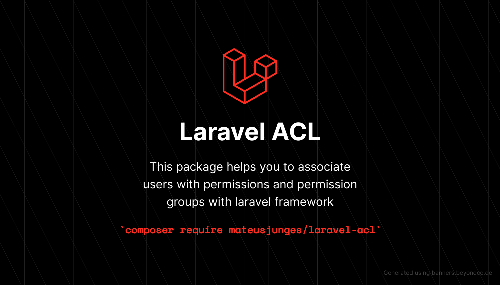

# Laravel ACL

This package allows you to manage user permissions and groups in a database, 
and is compatible with Laravel v5.8 or higher.
Please check the [documentations](https:///junges.dev/documentation/laravel-acl).

# Sponsor my work!
If you think this package helped you in any way, you can sponsor me on GitHub!

# Tests
Run `composer test` to test this package.

# Contributing
Thank you for considering contributing for the Laravel ACL package! The contribution guide can be found [here](https://github.com/mateusjunges/laravel-acl/blob/master/CONTRIBUTING.md).
 
# Changelog

Please see [changelog](https://github.com/mateusjunges/laravel-acl/blob/master/CHANGELOG.md) for more information about the changes on this package.

# Credits

- [The Web Tier](https://thewebtier.com/laravel/understanding-roles-permissions-laravel/)
- [All Contributors](https://github.com/mateusjunges/laravel-acl/graphs/contributors)

# License
The Laravel ACL package is open-sourced software licenced under the [MIT License](https://opensource.org/licenses/MIT). 
Please see the [License File](https://github.com/mateusjunges/laravel-acl/blob/master/LICENSE) for more information.
